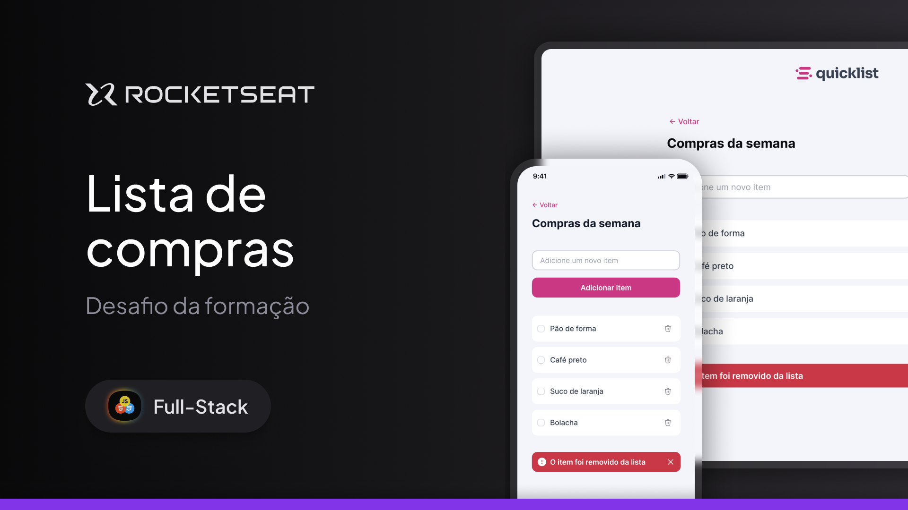

<h1 align="center"> Desafio Lista de Compras </h1>

O Primeiro desafio da parte Javascript da trilha Full-Stack, promovido pela Rocketseat para ensino de tecnologias WEB.   

  <a href="#tecnologias">Tecnologias</a>&nbsp;&nbsp;&nbsp;|&nbsp;&nbsp;&nbsp;
  <a href="#projeto">Projeto</a>&nbsp;&nbsp;&nbsp;|&nbsp;&nbsp;&nbsp;
  <a href="#layout">Layout</a>&nbsp;&nbsp;&nbsp;|&nbsp;&nbsp;&nbsp;
  <a href="#futuramente">Futuramente</a>&nbsp;&nbsp;&nbsp;|&nbsp;&nbsp;&nbsp;
  <a href="#licença">Licença</a>

  

 

  

## Tecnologias

- **HTML5** para estruturação do conteúdo
- **CSS3** para estilização e responsividade.
- **JavaScript** para adicionar e remover items.
- **Google Fonts** para personalização da tipografia

## Projeto

- [Visita o projeto online!](https://rodrigocarrico01.github.io/Project_lista_compras/)

## Layout

Tu podes visualizar o layout do projeto através [DESTE LINK](https://www.figma.com/design/RSOJ3wT6lQKnu2oCIcqJPA/Lista-de-compras-(Community)?node-id=0-1&p=f&t=ZHrN9sflFpqasHbk-0). É necessário ter conta no [Figma](https://figma.com) para acedê-lo.

## Futuramente
- Guardar listas anteriores.
- Guardar valores gastos.

## Licença

Esse projeto está sob a licença MIT.

---

